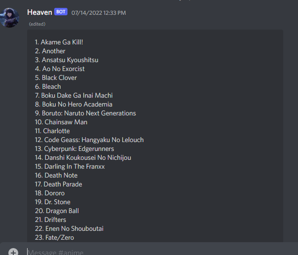
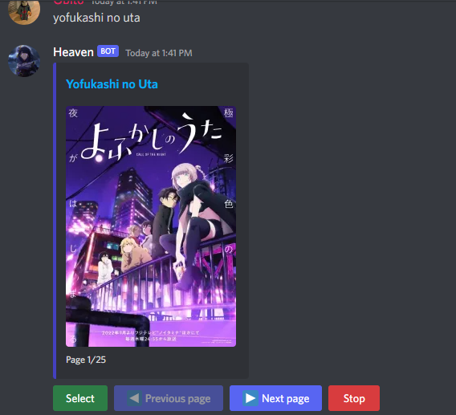
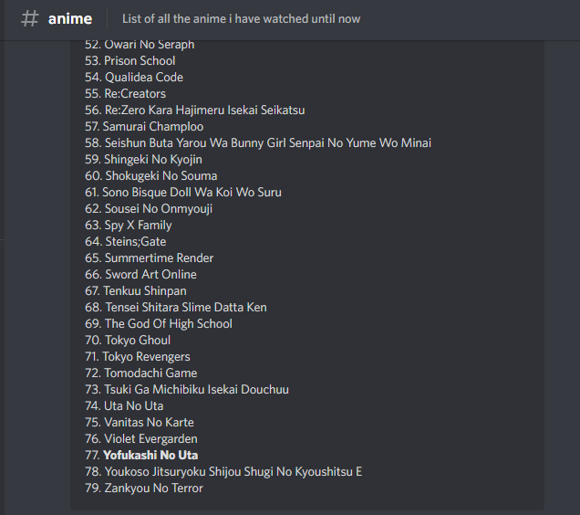
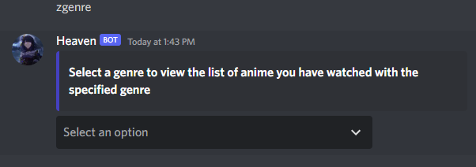
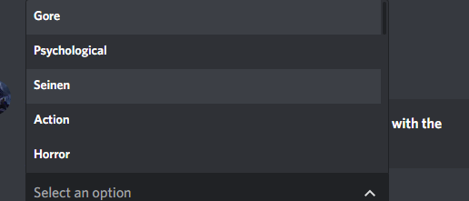
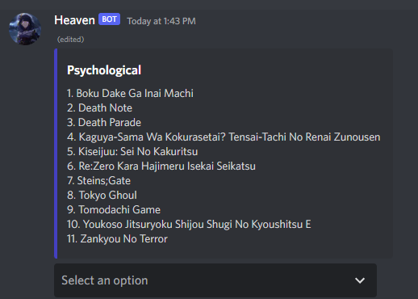

   

# Heaven-bot
A discord bot i made for storing my anime list in a server

## Features

</image>
 
To add anime to the list just type the name in channel 
</image>
</image>
 
</image>
</image>
</image>

## Licence

[Apache License 2.0](https://github.com/obitozx/Saigo/blob/main/LICENSE)

## Contribute

if you wish to contribute [click here](https://github.com/obitozx/heaven-bot/blob/main/CONTRIBUTING.md)

<tt>Would appreciate if you use the code with credits and also star this repository :) </tt>
